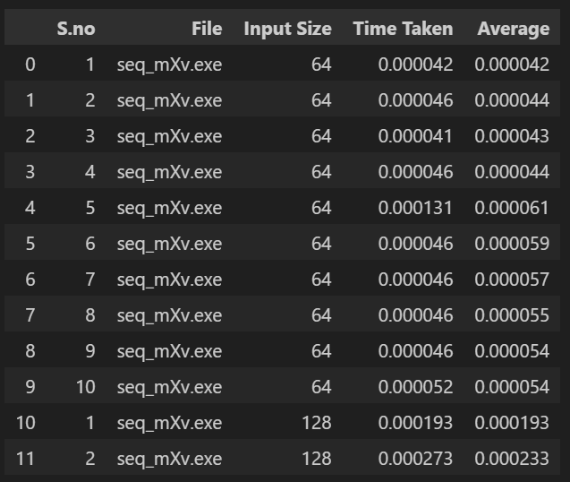

# Assignment 1
## Team Members
|std_id|Name|
|--------|-|
|k21-3084|Muneer Raza|
|k21-4739|Zainab Irshad|
|k21-3076|Abdul Rafay|
## Output Screenshots

## Results and Analysis

## Major Problems Encountered
1. **Issue 1:** 
    - In the MPI tiled program, initially, we encountered a problem with `mpi_scatter` as it divided the data equally among processors, leading to incorrect results because each processor required the entire vector. To address this issue, we implemented `mpi_bcast`, which effectively resolved the problem by ensuring that each processor received the complete vector.
    - **Resolved**

3. **Issue 2:**
    - We encountered an issue with the MPI initialization function being called before passing command-line arguments. This misplacement resulted in an error where the program terminated normally, but one process returned a non-zero exit code, causing the job to be aborted. Additionally, process rank 1 on node DESKTOP-P9UPIHE exited due to a segmentation fault (signal 11). To rectify this issue, we repositioned the `MPI initialization` function after passing the command-line arguments, resolving the segmentation fault problem.
    - **Resolved**
